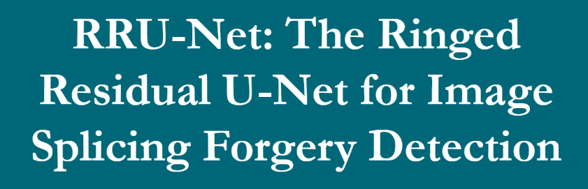
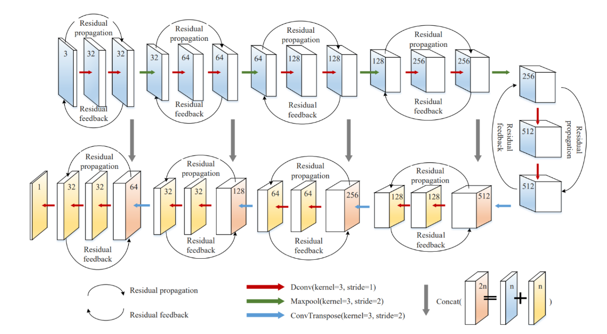
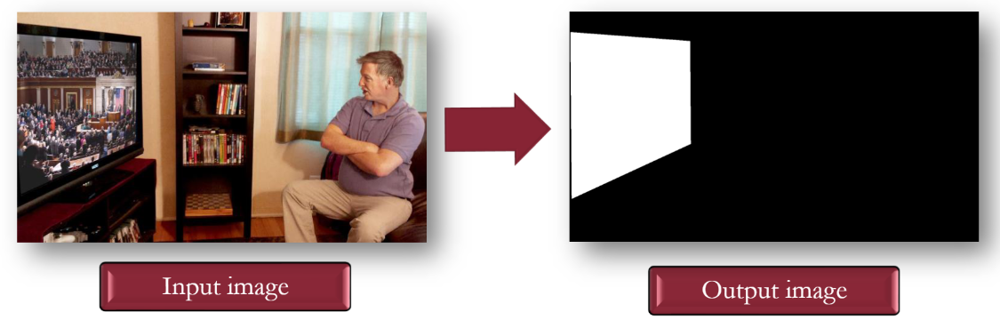
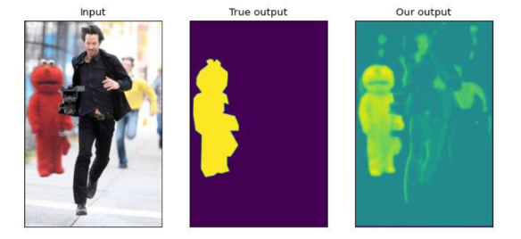
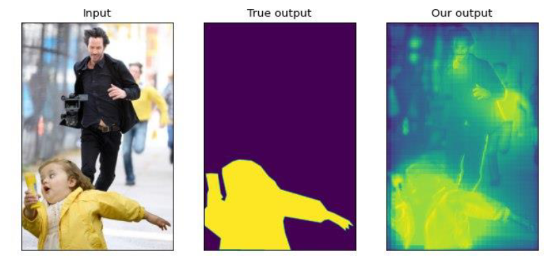

# 2021 V&P Final Project

    </img>

Final project for the course of Vision and Perception 2020/2021.

>Student: Alessandro Lambertini Mat: `1938390`;
>
>Student: Denise Landini Mat: `1938388`;

## 📝 Assignment

1.	Reimplement the network in the Paper [Link 🔗](https://ieeexplore.ieee.org/document/9025485) (Github page of the paper [Link 🔗](https://github.com/yelusaleng/RRU-Net))
    -   [V&P]RRU_NET.ipynb [Open In Collab 🔗](https://colab.research.google.com/github/lambertinialessandro/VP-FinalProject/blob/main/[V&P]RRU_NET.ipynb)
2.  Do some experiments to improve the network.
    -   [V&P]RRU_NET&FSM.ipynb [Open In Collab 🔗](https://colab.research.google.com/github/lambertinialessandro/VP-FinalProject/blob/main/[V&P]RRU_NET&FSM.ipynb)

## 💾 Dataset

-   ...

## 📜 Report

-   presentation [Link 🔗](./VP_Presentation_1938388_1938390.pdf)

    In thise file you can read more about the code and the result of the project.

## 💯 Final score:

Score: `33/30`

## 🙋 Info

for any doubt or clarification contact me on:

-   send me an email at: lambertini.1938390@studenti.uniroma1.it
-   send me a DM on instagram [Link 🔗](https://www.instagram.com/lambertinialessandro/)

## 🎞️ Snapshots

    </img>
     
    RRU-Net

    </img>
     
    random sample input from the dataset

    </img>
     
    random sample output from RRU-Net

    </img>
     
    random sample output from RRU-Net with FSM

